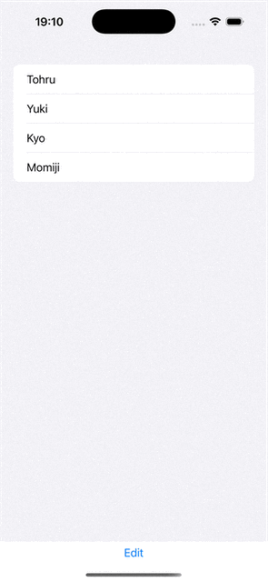
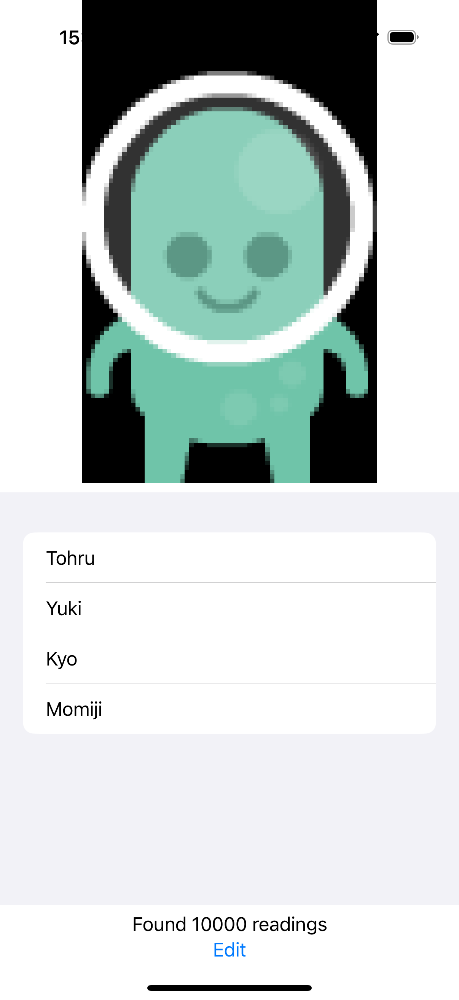

# Hot Prospects: Introduction

## Paul Hudson's ([@twostraws](https://x.com/twostraws)) 100 Days of Swift UI Project 16

Source URL: [link](https://www.hackingwithswift.com/books/ios-swiftui/hot-prospects-introduction)

>In this project we’re going to build Hot Prospects, which is an app to track who you meet at conferences. You’ve probably seen apps like it before: it will show a QR code that stores your attendee information, then others can scan that code to add you to their list of possible leads for later follow up.

### Letting users select items in a List

Source URL: [link](https://www.hackingwithswift.com/books/ios-swiftui/letting-users-select-items-in-a-list)

Really interesting technique for letting users select multiple items in a list and present it in a readable way (see animation below):

<div align="center">
  
</div>

This interesting effect is achieved by adding the `EditButton()` and the `selection.formatted()` in the code below:

```swift
import SwiftUI

struct ContentView: View {
    let users = ["Tohru", "Yuki", "Kyo", "Momiji"]
    @State private var selection = Set<String>()
    
    var body: some View {
        List(users, id:\.self, selection: $selection) { user in
            Text(user)
        }
        
        if !selection.isEmpty {
            Text("You selected: \(selection.formatted())")
        }
        
        EditButton()
    }
}
```

### Understanding Swift’s Result type

Source URL: [link](https://www.hackingwithswift.com/books/ios-swiftui/understanding-swifts-result-type)

> Swift provides a special type called Result that allows us to encapsulate either a successful value or some kind of error type, all in a single piece of data. So, in the same way that an optional might hold a string or might hold nothing at all, for example, Result might hold a string or might hold an error. The syntax for using it is a little odd at first, but it does have an important part to play in our projects.

`Result`is really interesting, although its syntax is a bit odd. Here's Paul's example usage:

```swift
func fetchReadings() async {
    let fetchTask = Task {
        let url = URL(string: "https://hws.dev/readings.json")!
        let (data, _) = try await URLSession.shared.data(from: url)
        let readings = try JSONDecoder().decode([Double].self, from: data)
        return "Found \(readings.count) readings"
    }
}
```

Paul presents two options for handling `Result`, my preferred way...

```swift
do {
    output = try result.get()
} catch {
    output = "Error: \(error.localizedDescription)"
}
```

... and through the `switch` statement as below:

```swift
switch result {
    case .success(let str):
        output = str
    case .failure(let error):
        output = "Error: \(error.localizedDescription)"
}
```

### Controlling image interpolation in SwiftUI

Basically, `interpolation(.none)` in the code below ensures that the small image will be pixelated, but not blurred, when resized.

```swift
Image(.example)
    .interpolation(.none)
    .resizable()
    .scaledToFit()
    .background(.black)
```

The result:

<div align="center">
  
</div>

## Acknowledgments

Original code created by: [Paul Hudson - @twostraws](https://x.com/twostraws) (Thank you!)

Made with :heart: by [@cewitte](https://x.com/cewitte)
