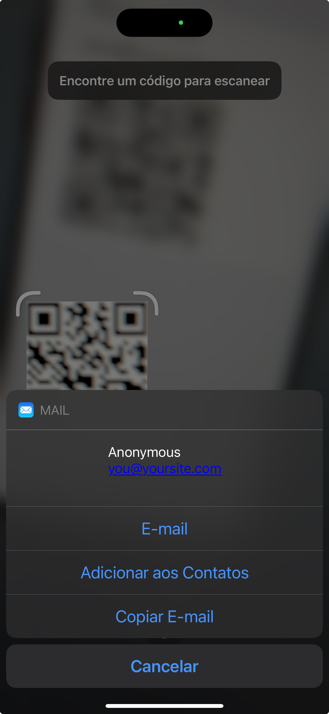
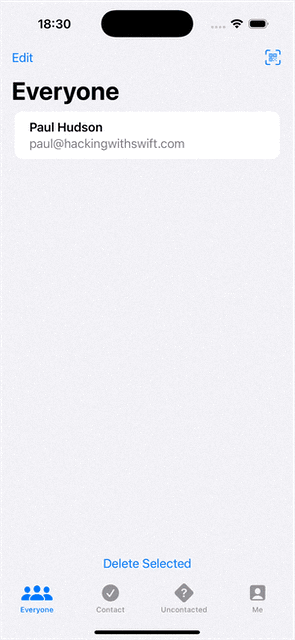

# Hot Prospects: Introduction

## Paul Hudson's ([@twostraws](https://x.com/twostraws)) 100 Days of Swift UI Project 16

Source URL: [link](https://www.hackingwithswift.com/books/ios-swiftui/hot-prospects-introduction)

>In this project we’re going to build Hot Prospects, which is an app to track who you meet at conferences. You’ve probably seen apps like it before: it will show a QR code that stores your attendee information, then others can scan that code to add you to their list of possible leads for later follow up.

### Letting users select items in a List

Source URL: [link](https://www.hackingwithswift.com/books/ios-swiftui/letting-users-select-items-in-a-list)

Really interesting technique for letting users select multiple items in a list and present it in a readable way (see animation below):

<div align="center">
  
</div>

This interesting effect is achieved by adding the `EditButton()` and the `selection.formatted()` in the code below:

```swift
import SwiftUI

struct ContentView: View {
    let users = ["Tohru", "Yuki", "Kyo", "Momiji"]
    @State private var selection = Set<String>()
    
    var body: some View {
        List(users, id:\.self, selection: $selection) { user in
            Text(user)
        }
        
        if !selection.isEmpty {
            Text("You selected: \(selection.formatted())")
        }
        
        EditButton()
    }
}
```

### Understanding Swift’s Result type

Source URL: [link](https://www.hackingwithswift.com/books/ios-swiftui/understanding-swifts-result-type)

> Swift provides a special type called Result that allows us to encapsulate either a successful value or some kind of error type, all in a single piece of data. So, in the same way that an optional might hold a string or might hold nothing at all, for example, Result might hold a string or might hold an error. The syntax for using it is a little odd at first, but it does have an important part to play in our projects.

`Result`is really interesting, although its syntax is a bit odd. Here's Paul's example usage:

```swift
func fetchReadings() async {
    let fetchTask = Task {
        let url = URL(string: "https://hws.dev/readings.json")!
        let (data, _) = try await URLSession.shared.data(from: url)
        let readings = try JSONDecoder().decode([Double].self, from: data)
        return "Found \(readings.count) readings"
    }
}
```

Paul presents two options for handling `Result`, my preferred way...

```swift
do {
    output = try result.get()
} catch {
    output = "Error: \(error.localizedDescription)"
}
```

... and through the `switch` statement as below:

```swift
switch result {
    case .success(let str):
        output = str
    case .failure(let error):
        output = "Error: \(error.localizedDescription)"
}
```

### Controlling image interpolation in SwiftUI

Basically, `interpolation(.none)` in the code below ensures that the small image will be pixelated, but not blurred, when resized.

```swift
Image(.example)
    .interpolation(.none)
    .resizable()
    .scaledToFit()
    .background(.black)
```

The result:

<div align="center">
  
</div>

### Creating context menus

Source URL: [link](https://www.hackingwithswift.com/books/ios-swiftui/creating-context-menus)

>SwiftUI lets us attach context menus to objects to provide this extra functionality, all done using the `contextMenu()` modifier. You can pass this a selection of buttons and they’ll be shown in order, so we could build a simple context menu to control a view’s background color like this:

```swift
Text("Hello, color!")
    .padding()
    .background(backgroundColor)

Text("Change Color")
    .padding()
    .contextMenu {
        Button("Red", systemImage: "checkmark.circle.fill", role: .destructive) {
            backgroundColor = .red
        }
        
        Button("Green") {
            backgroundColor = .green
        }
        
        Button("Blue") {
            backgroundColor = .blue
        }
    }
```

### Adding custom row swipe actions to a List

Source URL: [link](https://www.hackingwithswift.com/books/ios-swiftui/adding-custom-row-swipe-actions-to-a-list)

>We get this full functionality in SwiftUI using the `swipeActions()1 modifier, which lets us register one or more buttons on one or both sides of a list row. By default buttons will be placed on the right edge of the row, and won’t have any color, so this will show a single gray button when you swipe from right to left.

```swift
List(users, id:\.self, selection: $selection) { user in
    Text(user)
        .swipeActions {
            Button("Delete", systemImage: "minus.circle", role: .destructive) {
                print("Deleting")
            }
        }
        .swipeActions(edge: .leading) {
            Button("Pin", systemImage: "pin") {
                print("Pinning")
            }
            .tint(.orange)
        }
}
```

### Scheduling local notifications

Source URL: [link](https://www.hackingwithswift.com/books/ios-swiftui/scheduling-local-notifications)

>iOS has a framework called UserNotifications that does pretty much exactly what you expect: lets us create notifications to the user that can be shown on the lock screen. We have two types of notifications to work with, and they differ depending on where they were created: local notifications are ones we schedule locally, and remote notifications (commonly called push notifications) are sent from a server somewhere.

>Remote notifications require a server to work, because you send your message to Apple’s push notification service (APNS), which then forwards it to users. But local notifications are nice and easy in comparison, because we can send any message at any time as long as the user allows it.

Here's the code:

```swift
VStack {
    Button("Request Permission") {
        UNUserNotificationCenter.current().requestAuthorization(options: [.alert, .badge, .sound]) { success, error in
            if success {
                print("All set!")
            } else if let error {
                print(error.localizedDescription)
            }
        }
    }

    Button("Schedule Notification") {
        let content = UNMutableNotificationContent()
        content.title = "Feed the cat"
        content.subtitle = "It looks hungry"
        content.sound = UNNotificationSound.default

        // show this notification five seconds from now
        let trigger = UNTimeIntervalNotificationTrigger(timeInterval: 5, repeats: false)

        // choose a random identifier
        let request = UNNotificationRequest(identifier: UUID().uuidString, content: content, trigger: trigger)

        // add our notification request
        UNUserNotificationCenter.current().add(request)
    }
}
```

### Adding Swift package dependencies in Xcode

Source URL: [link](https://www.hackingwithswift.com/books/ios-swiftui/adding-swift-package-dependencies-in-xcode)

>Xcode comes with a dependency manager built in, called Swift Package Manager (SPM). You can tell Xcode the URL of some code that’s stored online, and it will download it for you. You can even tell it what version to download, which means if the remote code changes sometime in the future you can be sure it won’t break your existing code.

>The first step is to add the package to our project: go to the File menu and choose Add Package Dependencies. Enter the URL where the code for my example package is stored. Xcode will fetch the package, read its configuration, and show you options asking which version you want to use. The default will be “Version – Up to Next Major”, which is the most common one to use and means if the author of the package updates it in the future then as long as they don’t introduce breaking changes Xcode will update the package to use the new versions.

>The reason this is possible is because most developers have agreed a system of semantic versioning (SemVer) for their code. If you look at a version like 1.5.3, then the 1 is considered the major number, the 5 is considered the minor number, and the 3 is considered the patch number. If developers follow SemVer correctly, then they should:

- > Change the patch number when fixing a bug as long as it doesn’t break any APIs or add features.
- > Change the minor number when they added features that don’t break any APIs.
- > Change the major number when they do break APIs.

An interesting part of the code: 

>We need to convert that array of integers into strings. This only takes one line of code in Swift, because sequences have a `map()` method that lets us convert an array of one type into an array of another type by applying a function to each element. In our case, we want to initialize a new string from each integer, so we can use `String.init` as the function we want to call.

```swift
var results: String {
    let selected = possibleNumbers.random(7).sorted()
    let strings = selected.map(String.init)
    return strings.formatted()
}
```

### Building our tab bar

Source URL: [link](https://www.hackingwithswift.com/books/ios-swiftui/building-our-tab-bar)

Branch: `release`

`TavView`is very easy to be implemented, and the code speaks for itself:

```swift
TabView {
    ProspectsView()
        .tabItem {
            Label("Everyone", systemImage: "person.3")
        }
    ProspectsView()
        .tabItem {
            Label("Contacted", systemImage: "checkmark.circle")
        }
    ProspectsView()
        .tabItem {
            Label("Uncontacted", systemImage: "questionmark.diamond")
        }
    MeView()
        .tabItem {
            Label("Me", systemImage: "person.crop.square")
        }
}
```

### Storing our data with SwiftData

Source URL: [link](https://www.hackingwithswift.com/books/ios-swiftui/storing-our-data-with-swiftdata)

Notes on using `SwiftData`:

It requires a class that works as a model, like the one below which includes the `@Model` macro _(note: don't forget to `import SwiftData` whenever `model`, etc are referenced)_:

```swift
@Model
class Prospect {
    var name: String
    var emailAddress: String
    var isContacted: Bool
}
```

Then add the `.modelContainer()`to hold the data as below:

```swift
WindowGroup {
    ContentView()
}
.modelContainer(for: Prospect.self)
```

Finally, use it within your views...

```swift
@Query(sort: \Prospect.name) var prospects: [Prospect]
@Environment(\.modelContext) var modelContext
```

... while not forgetting to add the `.modelContainer` for previews:

```swift
#Preview {
    ProspectsView(filter: .none)
        .modelContainer(for: Prospect.self)
}
```

### Dynamically filtering our SwiftData query

Source URL: [link](https://www.hackingwithswift.com/books/ios-swiftui/dynamically-filtering-our-swiftdata-query)

Branch: `release`

The line below queries the database for all the Prospects and assings them to a Prospect array sorted by name.

`@Query(sort: \Prospect.name) var prospects: [Prospect]`

>We already have a default query in place, but if we add an initializer we can override that when a filter is set.

```swift
init(filter: FilterType) {
    self.filter = filter

    if filter != .none {
        let showContactedOnly = filter == .contacted

        _prospects = Query(filter: #Predicate {
            $0.isContacted == showContactedOnly
        }, sort: [SortDescriptor(\Prospect.name)])
    }
}
```

### Generating and scaling up a QR code

Source URL: [link](https://www.hackingwithswift.com/books/ios-swiftui/generating-and-scaling-up-a-qr-code)

Here Paul teaches us how to create a QRCode in Swift, and perhaps unsurprisingly, Apple has a library to help us do so. The first task is importing this package:

```swift
import CoreImage.CIFilterBuiltins
```

Then here's a function that easily creates (but, of course, not reads) QRCodes:

```swift
func generateQRCode(from string: String) -> UIImage {
    filter.message = Data(string.utf8)
    
    if let outPutImage = filter.outputImage {
        if let cgimage = context.createCGImage(outPutImage, from: outPutImage.extent) {
            
            return UIImage(cgImage: cgimage)
        }
    }
    
    return UIImage(systemName: "xmark.circle") ?? UIImage()
}
```

SwiftUI's image generation process is kind of confusing, and it's arguably responsible for the convoluted code above.

Another important aspect when generating QRCodes is that SwiftUI will generate images only big enough to show the necessary pixels on screen, which will likely be too small. If you scale the image, it will also try to interpolate, giving your QRCode an undesired blur effect. That's why we need to turn interpolation off as below:

```swift
 Image(uiImage: generateQRCode(from: "\(name)\n\(emailAddress)"))
    .interpolation(.none)
    .resizable()
    .scaledToFit()
    .frame(width: 200, height: 200)
```

I also find surprising how there's no need to specify the QRCode type. iOS seems to understand the name and email in the example above in two consecutive lines:

<div align="center">
  
</div>

Interesting enough is that I can also use Swift libraries to customize QRCodes. With a little help from ChatGPT, the code below creates a QRCode with custom colors and a logo in the middle (here only for my reference, I haven't tested the result yet):

```swift
import SwiftUI
import CoreImage.CIFilterBuiltins

struct CustomQRCodeView: View {
    let context = CIContext()
    let filter = CIFilter.qrCodeGenerator()
    
    var body: some View {
        if let qrImage = generateCustomQRCode(from: "https://www.ag24horas.com.br") {
            Image(uiImage: qrImage)
                .resizable()
                .interpolation(.none)
                .scaledToFit()
                .frame(width: 250, height: 250)
        } else {
            Text("Error while creating the QRCode")
        }
    }
    
    func generateCustomQRCode(from string: String) -> UIImage? {
        // 1. Creates the QRCode
        let data = Data(string.utf8)
        filter.setValue(data, forKey: "inputMessage")

        // the optional value below increases the error correction level to "H" (High)
        filter.setValue("H", forKey: "inputCorrectionLevel")
        
        guard let qrCIImage = filter.outputImage else { return nil }

        // 2. Applies the color
        let colorFilter = CIFilter.falseColor()
        colorFilter.inputImage = qrCIImage
        colorFilter.color0 = CIColor(color: UIColor.systemPurple) // cor dos quadrados
        colorFilter.color1 = CIColor(color: UIColor.white)        // cor de fundo
        
        guard let coloredQRImage = colorFilter.outputImage else { return nil }

        // 3. Converts to CGImage e resizes
        if let cgImage = context.createCGImage(coloredQRImage, from: coloredQRImage.extent) {
            let qrUIImage = UIImage(cgImage: cgImage, scale: 1.0, orientation: .up)
            
            // 4. Add logo to the middle of the image
            return addLogo(to: qrUIImage, logo: UIImage(named: "logo")!)
        }
        
        return nil
    }
    
    func addLogo(to qrImage: UIImage, logo: UIImage) -> UIImage {
        let size = qrImage.size
        let renderer = UIGraphicsImageRenderer(size: size)
        
        return renderer.image { _ in
            qrImage.draw(in: CGRect(origin: .zero, size: size))
            
            let logoSize = CGSize(width: size.width * 0.25, height: size.height * 0.25)
            let logoOrigin = CGPoint(
                x: (size.width - logoSize.width) / 2,
                y: (size.height - logoSize.height) / 2
            )
            
            logo.draw(in: CGRect(origin: logoOrigin, size: logoSize))
        }
    }
}
```

### Posting notifications to the lock screen

Source URL: [link](https://www.hackingwithswift.com/books/ios-swiftui/posting-notifications-to-the-lock-screen)

Branch: `release`

Sending a local notification (one that does not relies on Apple's cloud services) requires 2 steps:

1- Import the package

```swift
import UserNotifications
```

2- Create a `func` to add the notification:

```swift
func addNotification(for prospect: Prospect) {
    let center = UNUserNotificationCenter.current()

    let addRequest = {
        let content = UNMutableNotificationContent()
        content.title = "Contact \(prospect.name)"
        content.subtitle = prospect.emailAddress
        content.sound = UNNotificationSound.default

        var dateComponents = DateComponents()
        dateComponents.hour = 9
        let trigger = UNCalendarNotificationTrigger(dateMatching: dateComponents, repeats: false)

        let request = UNNotificationRequest(identifier: UUID().uuidString, content: content, trigger: trigger)
        center.add(request)
    }

    center.getNotificationSettings { settings in
        if settings.authorizationStatus == .authorized {
            addRequest()
        } else {
            center.requestAuthorization(options: [.alert, .badge, .sound]) { success, error in
                if success {
                    addRequest()
                } else if let error {
                    print(error.localizedDescription)
                }
            }
        }
    }
}
```

The code above will trigger an alert at 9am. For testing purposes, we can replace the `trigger` above with the following code, which triggers the alert after 5 seconds:

```swift
let trigger = UNTimeIntervalNotificationTrigger(timeInterval: 5, repeats: false)
```

Here's the final result (with the alert set to 5 seconds for testing):

<div align="center">
  
</div>


## Acknowledgments

Original code created by: [Paul Hudson - @twostraws](https://x.com/twostraws) (Thank you!)

Made with :heart: by [@cewitte](https://x.com/cewitte)
